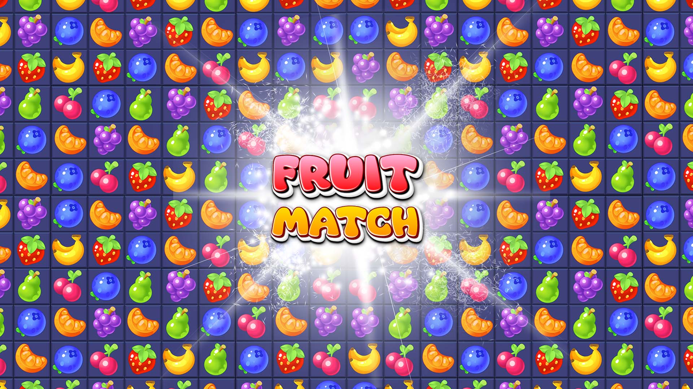
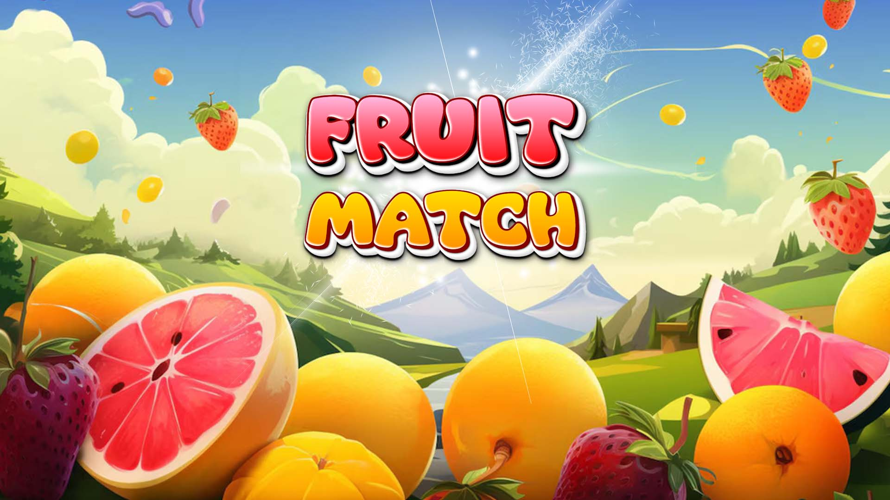
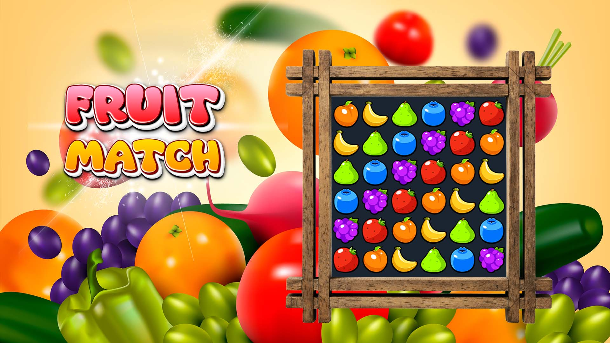
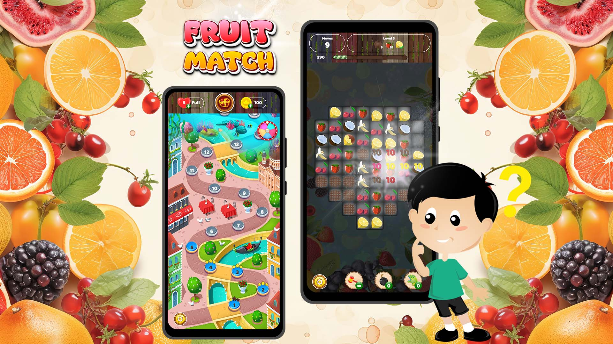

# 🎮 Fruit Match Android Game


<p align="center">
  
</p>

### Overview :
Fruit Match is a fun and addictive puzzle game where players match colorful fruits to score points and complete levels. Designed for all ages, the game features vibrant graphics, exciting sound effects, and challenging levels that keep players engaged for hours! 

--
## 📱 Features

- ✅ Hundreds of Levels: Enjoy exciting puzzles with increasing difficulty.
- ✅ Boosters & Power-ups: Use bombs, color blasts, and lightning fruits to clear the board faster!
- ✅ Special Challenges: Time-based levels, limited moves, and unique obstacles like ice blocks and locked fruits.
- ✅ Daily Rewards: Log in every day to claim free boosters and extra moves.
- ✅ Offline Mode: Play anytime, anywhere, without an internet connection!
- ✅ Vibrant Graphics & Animations: Stunning fruit designs and smooth gameplay make the game visually appealing.
- ✅ Fun for All Ages: Easy to learn but challenging to master—perfect for kids and adults!

🎮 Download Fruit Match today and start your delicious puzzle adventure! 🎮
Match, swap, and blast your way to victory! 🍏✨

Play And Enjoy Fruit Match Game!! To More FUN!!


## 🛠 Technologies Used

- Java
- Android Studio
- Android SDK
- XML Layout Design


## 🎯 Gameplay

🕹️ How to Play?

1️⃣ Swap and match three or more identical fruits in a row or column.
2️⃣ Create special fruit combos for powerful boosts!
3️⃣ Complete the level objectives before running out of moves.
4️⃣ Unlock new levels and earn rewards as you progress.


## 📸 Screenshots

<p align="center" float="left">
 <br>
  <br>
   <br>
    <br>
</p>l̥


## 📂 Project Structure

```
app/
 ├── java/
 ├── activities/
 ├── models/
 ├── utils/
 └── res/
```


## Final Repository Structure

```
Fruit-match-Game
│
├── app
├── screenshots
├── README.md
└── LICENSE
```


## ⚙ Installation

1. Clone the repository

```
git clone https://github.com/panthitech/juicymatch.git
```

2. Open the project in Android Studio

3. Run the app on an Android device or emulator


## 📌 Topics

android • android-game • fruit-match • java • android-studio


## 📜 License

This project is licensed under the MIT - see the [LICENSE](LICENSE) file for details.


## 👩‍💻 Author

**Shraddha Kathiriya**  
Android App Developer  
🌐 GitHub: https://github.com/panthitech
